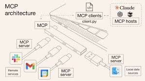

# ktds7_001
ktds MS AI 과정 7기 Repository

1. 이름
2. 프로젝트명
   - AI를 활용한 기술문서 자동 요약 및 오류 분석
3. 간단한설명
   - 자료 : Tibero 관련 기술문서, 로그, 매뉴얼 등
   - AI가 자동으로 핵심 개념 요약, 주요 오류/원인 설명, 해결 가이드 생성
4. 깃허브 링크
   - https://github.com/yhkwak76-sys/ktds7_001.git

--------------------------
## 마크다운 연습

### 부제목

[mcp image](./mcpjpg.jpg)

링크1
[네이버](http://www.naver.com)

테스트

